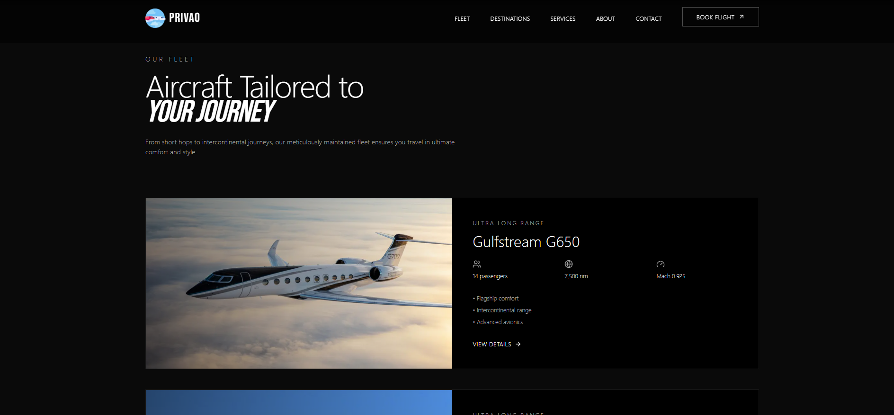

# Privao – Private Aviation Website

A studio‑grade, high‑performance marketing site for a private jet company. Built for elegance, speed, and responsiveness with cinematic visuals and smooth motion.

## Live Demo

- Website: https://privao.vercel.app/

## Highlights

- Modern, luxury aesthetic with a 2025 studio look
- Fully responsive across desktop, tablet, and mobile
- 60‑fps animations using Framer Motion and GPU‑friendly transforms
- Optimized image handling and hero background slideshow
- Fullscreen mobile navigation with smooth transitions
- Clean typography with Inter + Bebas Neue pairing

## Core Sections

- Hero: slideshow with 3 background images and bold headline/CTAs
- Navigation: sticky header, desktop links, fullscreen mobile menu
- Why Us: three premium cards with image overlays and micro‑interactions
- Fleet Preview: featured aircraft cards with specs and details CTA
- Stats: animated counters for trust signals
- Testimonials: elegant, swipe‑like transitions with dot navigation
- CTA Banner: full‑bleed background with strong conversion focus
- Footer: multi‑column links, socials, and contact information
- 404 & Error Pages: branded fallbacks with motion
- Developer Credit: subtle session‑based popup linking to Danish’s portfolio

## Screenshots

> All screenshots are in the project root.

### Hero & Header

### Why Us Cards

### Fleet Preview

### Numbers / Stats

### Testimonials

### CTA Banner

### Footer

## Credits

- Design & Development: [Danish](https://danishfolio.cc)
- Images: project `public/` assets
